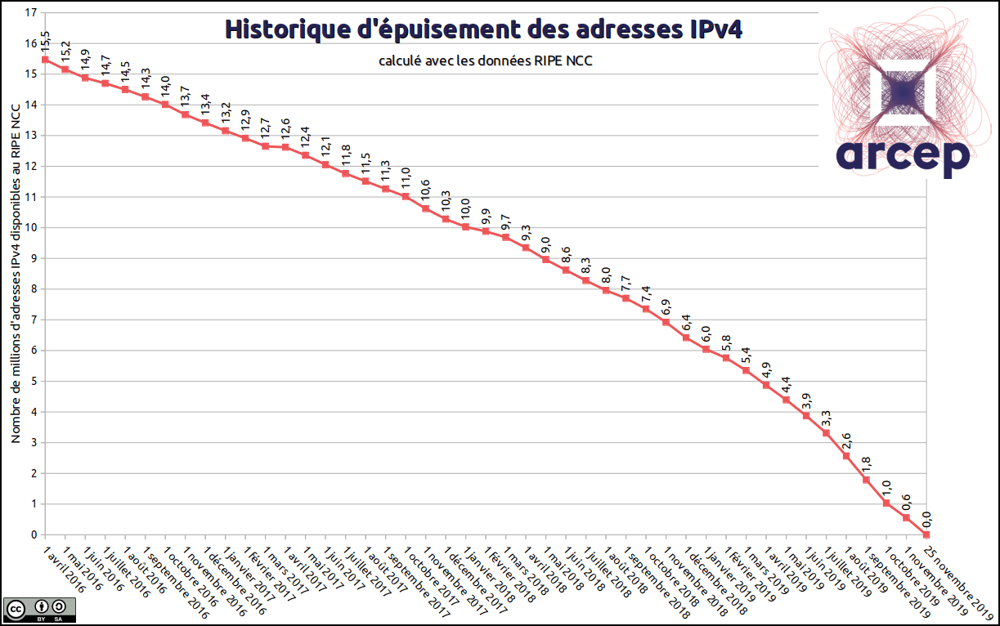
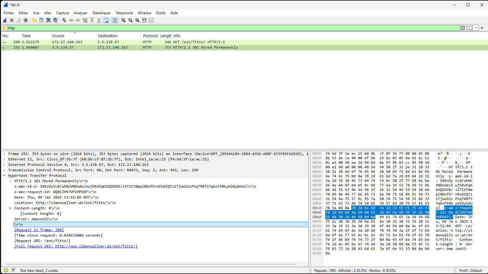

# TCP-IP (Transfer Control Protocol - Internet Protocol)

## Adressage dans Internet
L’adressage IP permet aux matériels de pouvoir communiquer entre eux. Bien évidemment, cet adressage comporte de (nombreuses) règles que nous allons aborder dans la suite de ce TP.

Deux systèmes d’adressage internet cohabitent (encore) à l’heure actuelle : adresse IPv4 (codée sur **32 bits**) et IPv6 depuis Juin 2011 (codée sur **128 bits**).

**Exemples**
* adresse ipv4 : *192.168.116.8*
* adresse ipv6 : *fe80::215:5dff:fe8b:771d*

**En France, le pourcentage d’utilisation d’IPv6 n’était que de 43% mi-2020 et 62% mi-2023 (le fin de migration est prévue pour 2030) !**

### 1.1 Identification d’une machine
Une machine (appelée aussi hôte ou host) est identifiée dans Internet par son **adresse**. L’adresse Internet d’une machine correspond à un numéro qui est **unique** dans le monde.

Pour des raisons **mnémoniques**, il est possible de donner un nom à une machine (ex : *toto*, *garonne*, *mimosa*, ...). Attention, ce nom n’est pas compris par le réseau pour le routage (il faut associer ce nom à une adresse IP) et certains hôtes ont plusieurs noms.

Les applications (sftp, https, ssh, ...) acceptent aussi bien les adresses que les noms.

### 1.2 Structure de l’adresse IPv4
L’adresse utilisée par le protocole IP (adresse IP), comporte deux champs : le champ ***adresse réseau*** (Network) dans Internet et le champ ***adresse hôte*** (Host) dans le réseau. Sa taille est de quatre octets. Elle est donnée pour ipv4 en notation décimale pointée (ex : 127.95.35.54).

Comme l’adresse IP contient l’adresse réseau, une station changeant de réseau change d’adresse. D’autre part, une station multi-domiciliée (qui dispose de plusieurs interfaces réseau) ou un routeur ont plusieurs adresses.

L’adresse réseau est donnée par un organisme officiel (l’[**IANA**](https://www.iana.org) - **I**nternet **A**ssigned **N**umbers **A**uthority, département de l’[**ICANN**](https://www.icann.org) – Internet **C**orporation for **A**ssigned **N**ames and **N**umbers) garantissant l’unicité de cette adresse.

### 1.3 Les classes d’adresses IPv4
Il existait à l’origine (septembre 1981) trois classes d’adresses IP qui permettent de gérer des réseaux de tailles diverses - [RFC 790](https://datatracker.ietf.org/doc/html/rfc790) [^1]

Ainsi, les adresses de classe **A** ont leur premier octet compris entre **1** et **127**, les adresses de classe **B** entre **128** et **191** et les adresses de classe **C** entre **192** et **223**.

Les adresses qui ont la valueur du premier octet supérieur à **223** sont des adresses [spéciales](https://fr.wikipedia.org/wiki/Classe_d%27adresse_IP#cite_note-rfc-2) qui ne désignent pas une machine (cf. Figure 1).

**Remarque** : Les adresses IP commençant par 127 sont réservées pour des tests en local. Par exemple **127.0.0.1** correspond à la machine locale (**localhost**) ou adresse dite de **loopback**.

La nouvelle version de IP (**IPv6** pour IP version 6) définit les adresses sur 128 bits au lieu de 32 de façon à pouvoir gérer un plus grand nombre d’adresses et de niveaux hiérarchiques d’adresses. Cela dit les adresses IP sur 128 bits ne sont pas encore tout à fait généralisées.

| **Classe** | **Bits de départ** | **Début** | **Fin** | **Notation CIDR** | **Masque de sous-réseau par défaut** |
| --- | --- | --- | --- | --- | --- |
| **Classe A** | **0** | 1.0.0.0 | 127.255.255.255 | /8 | 255.0.0.0 |
| **Classe B** | **10** | 128.0.0.0 | 191.255.255.255 | /16 | 255.255.0.0 |
| **Classe C** | **110** | 192.0.0.0 | 223.255.255.255 | /24 | 255.255.255.0 |
| **Classe D** (multicast) | 1110 | 224.0.0.0 | 239.255.255.255 | /8 | non défini |
| **Classe E** (réservée) | 1111 | 240.0.0.0 | 255.255.255.255 |  | non défini |

**Figure 1** : résumé des plages d’adresses IPv4

### Calcul du nombre de réseau de chaque classe et du nombre de machines.

|  | **Classe A** | **Classe B** | **Classe C** |
| --- | --- | --- | --- |
| ***Nbre de réseaux en théorie*** | 27 = 128 | 214 = 16 384 | 221 = 2 097 152 |
| ***Nbre d’équipement par réseau en théorie*** | 224 = 16 777 216 | 216 = 65 536 | 28 = 256 |
| ***Nbre de réseaux en pratique*** | 27-2 = 126  valeurs 0 [^2] et 127 [^3] interdites | 214 = 16 384 | 221 = 2 097 152 |
| ***Nbre d’équipement par réseau en pratique*** | 224 – 2 = 16.777.214 valeurs 0.0.0 et 255.255.255 interdites | 216 – 2 = 65.534  valeurs 0.0 et 255.255 interdites | 28 – 2 = 256  valeurs 0 et 255 interdites |
| ***Adresse la plus basse*** | 1.0.0.1 | 128.0.0.1 | 192.0.0.1 |
| ***Adresse la plus haute*** | 127.255.255.254 | 191.255.255.254 | 223.255.255.254 |
| ***Adresse réseaux privés*** | 10.\*.\*.\* réservé soit 1 réseau  127.\*.\*.\* (réseau local pour toute machine) | 172.16.\*.\* à  172.31.\*.\* soit 16 réseaux | 192.168.0.\* à  192.168.255.\* soit 256 réseaux |
| ***Nbre de réseaux Internet*** | 125 | 16.368 | 2.096.896 |

### 1.4 Notion de sous-réseaux
Comme on vient de le voir, il y a un très grand nombre possible de machines par réseau de classe A et B. Même un réseau de classe C, avec 254 machines possibles, est souvent trop important pour être contenu sur un même réseau physique (ex. sur un réseau Ethernet). Il a donc été nécessaire de fractionner un réseau en groupes plus petits.

La [**RFC 917**](https://datatracker.ietf.org/doc/html/rfc917) créé le concept de sous-réseaux qui introduit une hiérarchie complémentaire.

Un réseau partitionné en sous-réseau est vu de l’extérieur du réseau (par exemple de l’Internet) comme un seul réseau.

Pour créer les sous-réseaux on va utiliser une partie de l’identificateur d’hôte. Ainsi on aura 3 niveaux hiérarchiques d’identificateurs :
* l’identificateur de réseau dans Internet
* l’identificateur de sous-réseau dans le réseau
* l’identificateur d’hôte

On peut choisir de réserver un nombre quelconque de bits pour l’identificateur de sous-réseau en fonction du nombre de sous-réseau et du nombre maximum de machines par sous-réseau que l’on désire. La seule restriction est que chaque identificateur ne doit pas être composé que de 1 ou que de 0 et donc l’identificateur de sous-réseau (par convention uniquement et pour respecter d’anciennes utilisations de ces valeurs) tout comme l’identificateur d’hôte final ne peuvent pas être codés sur 1 bit.

### 1.5 Masques de sous-réseau
Pour pouvoir communiquer correctement avec une machine, il faut savoir si elle est connectée au même réseau (et donc si on peut lui *parler* directement) ou s’il faudra s’adresser à un équipement réseau (un routeur) qui pourra la contacter.

Deux machines sont connectées sur le même réseau physique si leurs identificateurs de réseau et leurs identificateurs de sous-réseau sont identiques. C’est à dire si les seuls bits qui différent entre les adresses sont contenus dans la partie identificateur d’hôte.

Compte tenu de la présence de sous-réseaux, on ne peut donc pas déterminer directement à partir d’une adresse IP et de sa classe quels sont les bits qui sont réservés aux identificateurs de machine.

Il faut donc une autre information : le nombre de bits utilisés pour l’identificateur de sous-réseau.

Pour indiquer cette information on utilise un masque binaire qui permet de déterminer la partie *identificateur de réseau* + *identificateur de sous-réseau* d’une adresse IP avec un simple **ET** (AND) binaire. Ce masque binaire est appelé : **masque de sous-réseau**.

La [**RFC 1338**](https://datatracker.ietf.org/doc/html/rfc1338) propose d’abolir la notion de classe et le CIDR (**C**lassless **I**nter-**D**omain **R**outing) est mis au point en 1993. L’utilisation de masques de longueur variable découpe l’espace d’adressage en blocs (**/x**) de taille variable permettant une utilisation plus efficace de l’espace d’adressage.
Néanmoins, le **25 novembre 2019 à15h35**, le [**RIPE NCC**](https://www.ripe.net/) (Registre Régional d’attribution des adresses IP Europe/Asie) a attribué les derniers blocs **/22** (les derniers blocs **/8** ont été attribués en 2012) - cf. Figure 2.

**Figure 2** : Epuisement des adresses IPv4 en Europe

Il reste encore quelques adresses IPv4 par bloc **/24** en utilisant des adresses inutilisées ou récupérées.

### 1.6. Exercices
1. Combien d’adresses IP peut posséder une machine ?
2. Calculez les valeurs possibles des octets d’un masque de sous-réseau sachant que les id. de sous-réseau ne peuvent pas être tous à 0 ni tous à 1.
3. Vous possédez l’adresse IP 130.20.76.103 et un masque de sous-réseau de 255.255.252.0. Trouvez l’adresse de broadcast correspondante à ce réseau.

## 2.Protocoles
### 2.1 Introduction
Tout au long du reste du TP, nous allons utiliser quelques outils réseaux afin de comprendre certaines notions

### 2.2 concept de protocole
* Rappelez ce qu’est un **protocole**
* Nous allons observer le trafic (cf. Figure 3) échangé entre un client et un sereur avec [Wireshark](https://www.wireshark.org), un outil dit de *capture réseau*.
  

**Figure 3** : échange http avec un serveur web [ressource pcapng](https://github.com/truillet/ups/blob/master/m2issd/ressources/wireshark_http.pcapng)
* Quelle est la commande HTTP utilisée par le client pour demander au serveur une ressource (fichier ou page web). Quels sont les types de réponse qui sont mis en évidence ? Donnez leur code de retour.
* Observez le contenu de la réponse du serveur.

**Aller plus loin** : [Liste des codes http](https://fr.wikipedia.org/wiki/Liste_des_codes_HTTP)

 ### 2.3 concept de couche et d’encapsulation
La communication précédente n’est en réalité pas directe entre les deux processus applicatifs (client et serveur) mais s’appuie pour fonctionner sur un certain nombre de services sous-jacents. Les systèmes de communication sont construits traditionnellement selon un modèle en couches.

* rappelez la définition du concept de « ***couche*** »
* sur la capture écran effectuée précédemment, observez les différents niveaux d’encapsulation d’un message.

### 2.4 concept de point d’accès au service
Cette mise en œuvre d’un protocole pose plusieurs questions : en particulier de savoir comment le réseau sait à quelle machine est destiné un message et comment chaque couche sait à quelle entité de la couche supérieure remettre le contenu d’une unité de protocole. En ce qui concerne la communication entre deux couches adjacentes, celle-ci se fait grâce à un **point d’accès au service** (SAP – **S**ervice **A**ccess **P**oint)

1. L’identifiant du point d’accès au service de la couche transport (T-SAP) est un **numéro de port**. Quel est le numéro de port pour l’entité HTTP de la machine **172.17.140.163** ? Et de la machine communiquant avec cette entité ?
2. Trouvez les autres identifiants de point d’accès aux services des couches réseaux (*network*) et de liaison (*datalink*) permettant l'acheminement des unités de données entre les couches Transport-Réseau et Réseaux-Liaison de données.

### 2.5 concept d’adresse
Chaque machine est identifiée par une adresse qui permet de la distinguer des autres. Une adresse assure donc l’identification des correspondants d’une communication. Il existe plusieurs types d’adresses en fonction du protocole utilisé.

Une adresse liaison de type Ethernet suit un format standardisé par l’IEEE [^4]. En particulier, les **trois premiers octets** identifient de manière unique le constructeur/vendeur à qui est attribuée l’adresse. Cet identifiant est appelé OUI (***O****rganizationally* ***U****nique* ***I****dentifier*)

Vous avez par exemple accès à la liste ici : [**macvendors**](https://macvendors.com)

1. Quelle est l’adresse Ethernet (MAC) de votre machine ? Utilisez la commande **/sbin/ifconfig** pour en savoir plus sous Unix/MacOS et **ipconfig /all** sous windows.
2. Déterminez à quelle organisation appartient cette adresse.

Une adresse IP comporte **deux parties** (voir partie **2.**) Le nombre de bits dédiés à la partie réseau peut être connu implicitement à partir des classes d’adresses ou explicitement par un masque réseau.
1. Quelle est l’adresse IP de votre machine ?
2. A partir du masque de réseau, déterminez la partie réseau et la partie équipement de votre adresse IP

Votre adresse est-elle une adresse privée ? (consultez **https://www.arin.net/knowledge/address_filters.html** pour en savoir plus)

L’[IANA](https://www.iana.org) est l’organisme responsable de la coordination du système d’adressage d’internet. Il alloue des adresses IP à des registres régionaux (**RIR** *–* **R**egional **I**nternet **R**egistry)

1. Donnez 5 registres régionaux d’adresses - [RIR](https://www.nro.net/about/rirs/) ainsi que la zone géographique qu’ils couvrent
2. Consultez le [registre d’allocation des plages d’adresses](https://www.iana.org/numbers) IPv4 sur le site de l’IANA
   * A quel RIR est alloué le préfixe **193** ?
   * Utilisez la commande **whois** ou le site **https://ripe.net/whois** pour savoir à qui appartient l’adresse **193.48.251.195**
   * Qui gère les adresses ayant le préfixe **130** ?
   * Interrogez le serveur **whois** pour avoir des informations sur l’adresse **130.120.84.5**
   * Que pouvez-vous en déduire sur les plages d’adresses **130.120.0.0 – 130.120.255.255**
   * Utiliser l’outil **nslookup** pour connaitre le ou les noms relatifs à l’adresse **www.univ-tlse3.fr** et son adresse ip
   * Faites de même avec l'adresse **www.google.fr** et son adresse ip. Que remarquez-vous ?
   * utiliser enfin l'outil **curl** avec la commande *curl -v www.univ-tlse3.fr*. Que pouvez-vous en conclure ?

## 3. autres commandes et outils réseau
Nous avons utilisé les commandes **ifconfig**, **whois**, **nslookup** et **curl**. Rappelez brièvement la fonction de ces quatre commandes.

La commande **ping** permet de tester la connectivité au niveau IP (*si elle n’est pas bloquée*). 
1. Testez cette commande entre votre machine et celle de votre voisin. Testez la connectivité avec l’adresse **www.univ-tlse3.fr** et une machine extérieure au réseau de l’université (exemple : **www.google.com**) Quelle différence pouvez-vous observer entre les différents *ping* ?

La commande **traceroute** permet de tracer l’itinéraire qu’emprunte un paquet IP entre un hôte source et destination (idem ... si ce n'est pas bloqué !).
1. Testez et observez les résultats de la commande. Faites un **traceroute** vers **www.univ-tlse3.fr**.

Représentez sur un schéma l’interconnexion (au niveau IP) entre votre PC et le serveur web de l’Université Toulouse 3.

Il en existe plein d'autres que nous verrons bientôt !

[^1]: **RFC** – Request For Comments, série numérotée de documents librement accessibles décrivant le plus souvent des spécifications techniques d’internet. La [RFC 1](https://datatracker.ietf.org/doc/html/rfc1) a été publiée le 7 avril 1969
[^2]: *0.0.0.0* est une adresse particulière utilisée comme adresse source dans les paquets de demande d’adresse DHCP par exemple.
[^3]: *127.0.0.1* est l’adresse de loopback.
[^4]: https://www.ieee.org – Institute of Electrical and Electronics Engineers 

